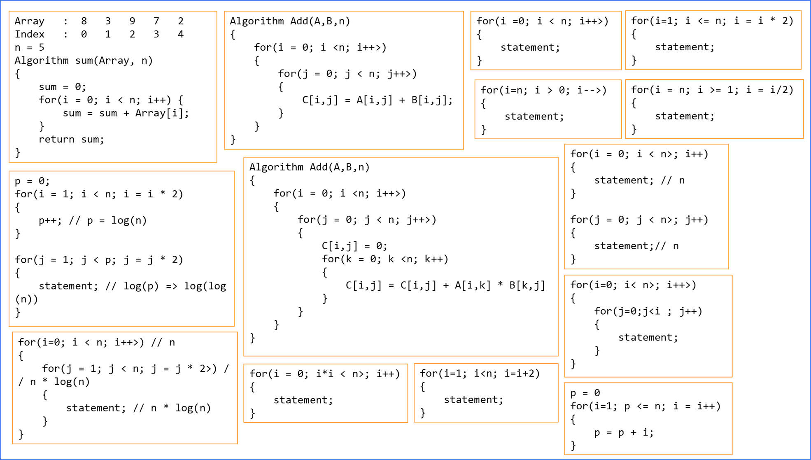

# Big-O Complexity Analysis

## Resources

- [Stanford CS106b handout](https://web.stanford.edu/class/archive/cs/cs106b/cs106b.1176/handouts/midterm/5-BigO.pdf): This handout walks through how to big - O complexity for loops and recursion.
- [Algorithms Course by Abdul Bari](https://www.youtube.com/watch?v=0IAPZzGSbME&list=PLDN4rrl48XKpZkf03iYFl-O29szjTrs_O): Big -O concepts and time complexity are covered in Section 1 of the YouTube series. Topics covered are as follow:

| No     | Topics                                                            |
| ------ | ----------------------------------------------------------------- |
| 1      | Introduction to Algorithms                                        |
| 1.1    | Priori Analysis and Posteriori Testing                            |
| 1.2    | Characteristics of Algorithm                                      |
| 1.3    | How Write and Analyze Algorithm                                   |
| 1.4    | Frequency Count Method                                            |
| 1.5.1  | Time Complexity #1                                                |
| 1.5.2  | Time Complexity Example #2                                        |
| 1.5.3  | Time Complexity of While and if #3                                |
| 1.6    | Classes of functions                                              |
| 1.7    | Compare Class of Functions                                        |
| 1.8.1  | Asymptotic Notation Big Oh -Omega - Theta #1                      |
| 1.8.2  | Asymptotic Notation Big Oh -Omega - Theta #2                      |
| 1.9    | Properties of Asymptotic Notation                                 |
| 1.10.1 | Comparison of Functions #1                                        |
| 1.10.2 | Comparison of Functions #2                                        |
| 1.11   | Best Worst and Average Case Analysis                              |
| 1.12   | Disjoint Sets Data Structure - Weighted Union and Collapsing Find |

